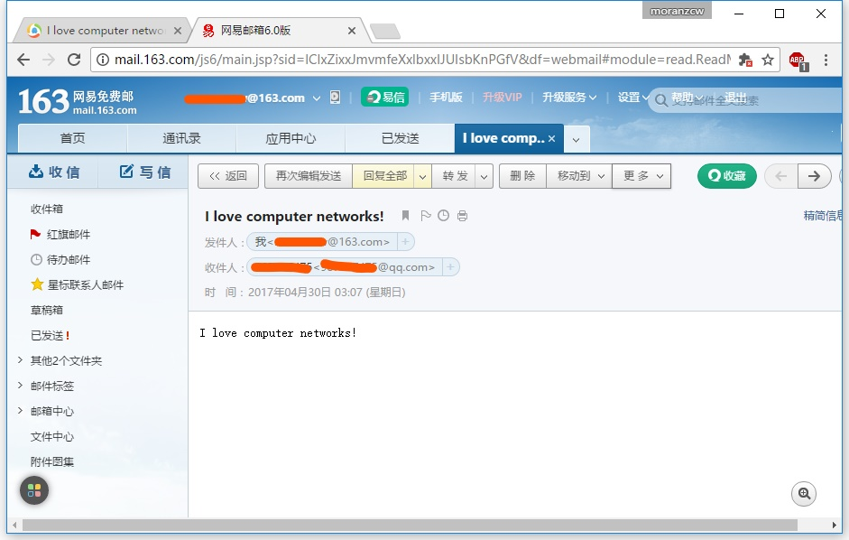

# 套接字编程作业3：邮件客户端

## 作业描述

《计算机网络：自顶向下方法》中第二章末尾给出了此编程作业的简单描述：

> 这个编程作业的目的是创建一个向任何接收方发送电子邮件的简单邮件客户。你的客户将必须与邮件服务器（如谷歌的电子邮件服务器）创建一个TCP连接，使用SMTP协议与该邮件服务器进行交谈，经该邮件服务器向某接收方（如你的朋友）发送一个电子邮件报文，最后关闭与该邮件服务器的TCP连接。
>
> 对本作业，配套Web站点为你的客户提供了框架代码。你的任务是完善该代码并通过向不同的用户账户发送电子邮件来测试你的客户。你也可以尝试通过不同的服务器（例如谷歌的邮件服务器和你所在大学的邮件服务器）进行发送。

## 详细描述

**官方文档：[Socket3_SMTP.pdf](Socket3_SMTP.pdf)**

**翻译：[作业3-邮件客户端-翻译.md](作业3-邮件客户端-翻译.md)**

## 实现

由于众所周知的原因，本文并不采用谷歌邮件服务器实现程序，而是采用网易163邮箱来完成。本文将实现一个SMTP客户端，使用163邮箱作为发件人，向指定的QQ邮箱发送一封邮件。

SMTP协议即简单邮件传输协议，允许用户按照标准发送/接收邮件。

在本文中，SMTP邮件客户端程序的基本流程如下：

1. 与163邮件服务器建立TCP连接，域名"smtp.126.com"，SMTP默认端口号25。建立连接后服务器将返回状态码220，代表服务就绪（类似HTTP，SMTP也使用状态码通知客户端状态信息）。
2. 发送"HELO"命令，开始与服务器的交互，服务器将返回状态码250（请求动作正确完成）。
3. 发送"AUTH LOGIN"命令，开始验证身份，服务器将返回状态码334（服务器等待用户输入验证信息）。
4. 发送**经过base64编码**的用户名（本例中是163邮箱的账号），服务器将返回状态码334（服务器等待用户输入验证信息）。
5. 发送**经过base64编码**的密码（本例中是163邮箱的密码），服务器将返回状态码235（用户验证成功）。
6. 发送"MAIL FROM"命令，并包含发件人邮箱地址，服务器将返回状态码250（请求动作正确完成）。
7. 发送"RCPT TO"命令，并包含收件人邮箱地址，服务器将返回状态码250（请求动作正确完成）。
8. 发送"DATA"命令，表示即将发送邮件内容，服务器将返回状态码354（开始邮件输入，以"."结束）。
9. 发送邮件内容，服务器将返回状态码250（请求动作正确完成）。
10. 发送"QUIT"命令，断开与邮件服务器的连接。

### 提示

* 有些邮箱默认关闭SMTP服务，比如本文使用的163邮箱。需要在设置中打开SMTP服务。另外，163邮箱在打开SMTP服务后，会设置一个授权码，在程序使用这个授权码作为密码登录，而不是平时使用的密码。
* 代码中带有"\*\*\*\*"的内容的是需要自行设置的内容，包含：发件人邮箱，收件人邮箱，登录邮箱的用户名和密码。

## 代码

**SMTPClient.py**

```python
from socket import *

# Mail content
subject = "I love computer networks!"
contenttype = "text/plain"
msg = "I love computer networks!"
endmsg = "\r\n.\r\n"

# Choose a mail server (e.g. Google mail server) and call it mailserver 
mailserver = "smtp.163.com"

# Sender and reciever
fromaddress = "******@163.com"
toaddress = "******@qq.com"

# Auth information (Encode with base64)
username = "******"
password = "******"

# Create socket called clientSocket and establish a TCP connection with mailserver
clientSocket = socket(AF_INET, SOCK_STREAM) 
clientSocket.connect((mailserver, 25))

recv = clientSocket.recv(1024).decode()
print(recv)
if recv[:3] != '220':
    print('220 reply not received from server.')

# Send HELO command and print server response.
heloCommand = 'HELO Alice\r\n'
clientSocket.send(heloCommand.encode())
recv1 = clientSocket.recv(1024).decode()
print(recv1)
if recv1[:3] != '250':
    print('250 reply not received from server.')

# Auth
clientSocket.sendall('AUTH LOGIN\r\n'.encode())
recv = clientSocket.recv(1024).decode()
print(recv)
if (recv[:3] != '334'):
	print('334 reply not received from server')

clientSocket.sendall((username + '\r\n').encode())
recv = clientSocket.recv(1024).decode()
print(recv)
if (recv[:3] != '334'):
	print('334 reply not received from server')

clientSocket.sendall((password + '\r\n').encode())
recv = clientSocket.recv(1024).decode()
print(recv)
if (recv[:3] != '235'):
	print('235 reply not received from server')

# Send MAIL FROM command and print server response.
clientSocket.sendall(('MAIL FROM: <' + fromaddress + '>\r\n').encode())
recv = clientSocket.recv(1024).decode()
print(recv)
if (recv[:3] != '250'):
	print('250 reply not received from server')

# Send RCPT TO command and print server response.
clientSocket.sendall(('RCPT TO: <' + toaddress + '>\r\n').encode())
recv = clientSocket.recv(1024).decode()
print(recv)
if (recv[:3] != '250'):
	print('250 reply not received from server')

# Send DATA command and print server response.
clientSocket.send('DATA\r\n'.encode())
recv = clientSocket.recv(1024).decode()
print(recv)
if (recv[:3] != '354'):
	print('354 reply not received from server')

# Send message data.
message = 'from:' + fromaddress + '\r\n'
message += 'to:' + toaddress + '\r\n'
message += 'subject:' + subject + '\r\n'
message += 'Content-Type:' + contenttype + '\t\n'
message += '\r\n' + msg
clientSocket.sendall(message.encode())

# Message ends with a single period.
clientSocket.sendall(endmsg.encode())
recv = clientSocket.recv(1024).decode()
print(recv)
if (recv[:3] != '250'):
	print('250 reply not received from server')

# Send QUIT command and get server response.
clientSocket.sendall('QUIT\r\n'.encode())

# Close connection
clientSocket.close()
```

**代码文件**

[SMTPClient.py](source/SMTPClient.py)

## 运行

一切正常的话，运行效果如下图所示，将会看到服务器返回的每条消息，其中包含每次操作后返回的状态码。


同时，我们还可以登陆发件人邮箱和收件人邮箱，在发件人的已发送文件夹中和收件人的收件箱中都能看到这封被发送的邮件。

**网易163邮箱：**



**QQ邮箱:**


