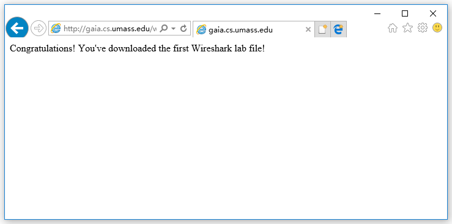
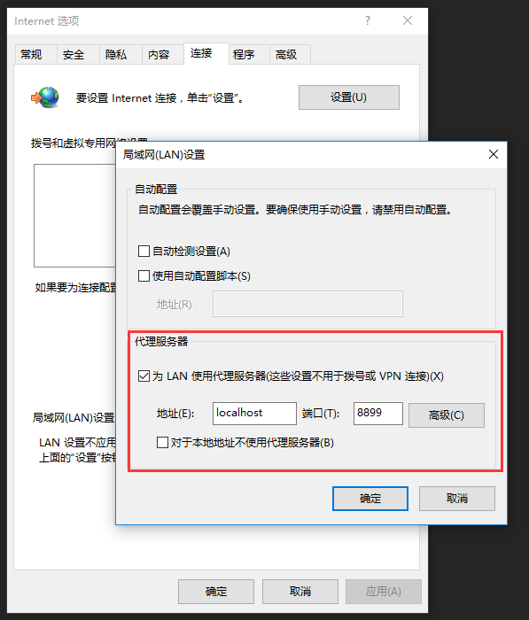
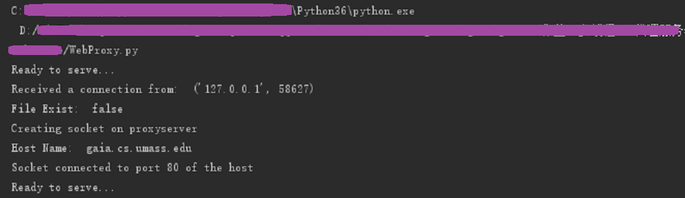
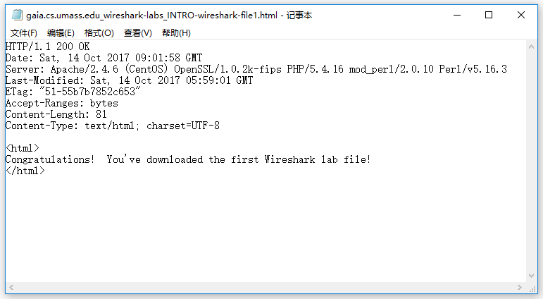

# 套接字编程作业4：多线程Web代理服务器

## 作业描述

《计算机网络：自顶向下方法》中第二章末尾给出了此编程作业的简单描述：

> 在这个编程作业中，你将研发一个简单的Web代理服务器。当你的代理服务器从一个浏览器收到某对象的HTTP请求，它生成对相同对象的一个新HTTP请求并向初始服务器发送。当该代理从初始服务器接收到具有该对象的HTTP响应时，它生成一个包括该对象的新HTTP响应，并发送给该客户。这个代理将是多线程的，使其在相同时间能够处理多个请求。
>
> 对本作业而言，配套Web网站对该代理服务器提供了框架代码。你的任务是完善该代码，然后测试你的代理，方式是让不同的浏览器经过你的代理来请求Web对象。

## 详细描述

**官方文档：[Socket4_ProxyServer.pdf](Socket4_ProxyServer.pdf)**

**翻译：[作业4-多线程Web代理服务器-翻译.md](作业4-多线程Web代理服务器-翻译.md)**

## 实现

书中的问题描述和官方文档描述略有区别，书中强调多线程的实现，官方文档强调缓存的实现，以官方文档为准。

按照官方文档的代码骨架，代理程序接收用户的GET请求，若请求的内容发已存在于代理服务器，则直接返回内容，若不存在，则转发该请求到目标服务器，接收目标服务器的响应，并将响应内容存储为文件，作为缓存，已被之后同样的请求。

## 代码

**WebProxy.py**

```python
#coding:utf-8
from socket import *

# 创建socket，绑定到端口，开始监听
tcpSerPort = 8899
tcpSerSock = socket(AF_INET, SOCK_STREAM)

# Prepare a server socket
tcpSerSock.bind(('', tcpSerPort))
tcpSerSock.listen(5)

while True:
    # 开始从客户端接收请求
    print('Ready to serve...')
    tcpCliSock, addr = tcpSerSock.accept()
    print('Received a connection from: ', addr)
    message = tcpCliSock.recv(4096).decode()

    # 从请求中解析出filename
    filename = message.split()[1].partition("//")[2].replace('/', '_')
    fileExist = "false"
    try:
        # 检查缓存中是否存在该文件
        f = open(filename, "r")
        outputdata = f.readlines()
        fileExist = "true"
        print('File Exists!')

        # 缓存中存在该文件，把它向客户端发送
        for i in range(0, len(outputdata)):
            tcpCliSock.send(outputdata[i].encode())
        print('Read from cache')

    # 缓存中不存在该文件，异常处理
    except IOError:
        print('File Exist: ', fileExist)
        if fileExist == "false":
            # 在代理服务器上创建一个tcp socket
            print('Creating socket on proxyserver')
            c = socket(AF_INET, SOCK_STREAM)

            hostn = message.split()[1].partition("//")[2].partition("/")[0]
            print('Host Name: ', hostn)
            try:
                # 连接到远程服务器80端口
                c.connect((hostn, 80))
                print('Socket connected to port 80 of the host')

                c.sendall(message.encode())
                # Read the response into buffer
                buff = c.recv(4096)

                tcpCliSock.sendall(buff)
                # Create a new file in the cache for the requested file.
                # Also send the response in the buffer to client socket
                # and the corresponding file in the cache
                tmpFile = open("./" + filename, "w")
                tmpFile.writelines(buff.decode().replace('\r\n', '\n'))
                tmpFile.close()

            except:
                print("Illegal request")

        else:
            # HTTP response message for file not found
            # Do stuff here
            print('File Not Found...Stupid Andy')
    # Close the client and the server sockets
    tcpCliSock.close()
tcpSerSock.close()
```

**代码文件**

[WebProxy.py](source/WebProxy.py)

## 运行

我们使用链接 http://gaia.cs.umass.edu/wireshark-labs/INTRO-wireshark-file1.html 测试我们的代理程序，该链接是本书第一个wireshark实验使用的测试连接，正常打开后会出现一条欢迎语句：



接着在本地运行代理服务器程序：


打开IE浏览器，并设置代理，指向我们自己编写的代理程序：



然后在IE浏览器中打开上文提到的链接，网页将正常显示：


这时代理服务器程序显示缓存中不存在该文件，转发请求并接收响应的消息：



同时在代理服务器程序的同目录下 会发现缓存的网页文件：


打开后的内容包含响应头和正文：



我们在浏览器中重新打开该链接，网页将正常显示，但是代理程序会显示缓存中已存在该网页，于是直接返回该文件：

