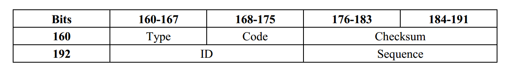

# 套接字编程作业5：ICMP Ping程序

**官方英文文档：[Socket5_ICMPpinger(chap4).pdf](Socket5_ICMPpinger(chap4).pdf)**

**以下内容为笔者翻译：**

------

## 套接字编程作业5：ICMP Ping程序

在这个作业中，您将更好地理解因特网控制报文协议（ICMP）。您会学习使用ICMP请求和响应消息实现Ping程序。
Ping是一个网络应用程序，用于测试某个主机在IP网络中是否可访问。它也用于测试计算机的网卡或测试网络延迟。它通过向目标主机发送ICMP“回显”包并监听ICMP“回显”应答来工作。“回显”有时称为"pong"。ping程序测量往返时间，记录数据包丢失，并输出接收到的回显包的统计摘要（往返时间的最小值、最大值和平均值，以及在某些版本中的平均值的标准差）。
您的任务是用python开发自己的Ping程序。您的程序将使用ICMP，但为了保持简单，将不完全遵循RFC 1739中的正式规范。请注意，您只需要编写程序的客户端，因为服务器端所需的功能几乎内置于所有操作系统中。
您的Ping程序能将ping请求发送到指定的主机，间隔大约一秒钟。每个消息包含一个带有时间戳的数据包。每个数据包发送完后，程序最多等待一秒，用于接收响应。如果一秒后服务器没有响应，那么客户端应假设ping数据包或pong数据包在网络中丢失（或者服务器已关闭）。

### 代码

您将在下面找到客户端的代码框架，您需要完成代码框架。你需要在#Fill in start and和#Fill in end标记的地方填写代码。每个地方可能需要一行或多行代码。

### 附加说明

1. 在“receiveOnePing”方法中，你需要获得ICMP_ECHO_REPLY结构并取出您需要的信息，如校验和、序列号、生存时间（TTL）等。在尝试完成“receiveOnePing”方法之前先研究“sendOnePing”方法。
2. 您不必关心校验和，因为它已经在代码中给出了。
3. 这个作业要求使用原始的sockets。在某些操作系统中，您可能需要管理员/root权限才能运行你的Ping程序。
4. 有关ICMP的更多信息，请参见此编程练习的结尾部分。

### 测试Ping程序
首先，通过发送数据包到本地主机来测试你的客户端，主机地址：127.0.0.1。

然后，你应该看看你的Ping程序如何通过在不同大洲的pinging服务器在网络中工作。

### 要提交的内容

你需要提交完整的客户端程序，以及程序分别对位于不同大洲的四个主机使用ping获得的输出信息的四张屏幕截图。

### 代理服务器的Python代码框架

```python
from socket import *
import os
import sys
import struct
import time
import select
import binascii

ICMP_ECHO_REQUEST = 8

def checksum(str):
    csum = 0
    countTo = (len(str) / 2) * 2
    count = 0
    while count < countTo:
        thisVal = ord(str[count+1]) * 256 + ord(str[count])
        csum = csum + thisVal
        csum = csum & 0xffffffffL
        count = count + 2
        
    if countTo < len(str):
        csum = csum + ord(str[len(str) - 1])
        csum = csum & 0xffffffffL

    csum = (csum >> 16) + (csum & 0xffff)
    csum = csum + (csum >> 16)
    answer = ~csum
    answer = answer & 0xffff
    answer = answer >> 8 | (answer << 8 & 0xff00)
    return answer

def receiveOnePing(mySocket, ID, timeout, destAddr):
    timeLeft = timeout

    while 1:
        startedSelect = time.time()
        whatReady = select.select([mySocket], [], [], timeLeft)
        howLongInSelect = (time.time() - startedSelect)
        if whatReady[0] == []: # Timeout
            return "Request timed out."

        timeReceived = time.time()
        recPacket, addr = mySocket.recvfrom(1024)

        #Fill in start

        #Fetch the ICMP header from the IP packet
        
        #Fill in end
        
        timeLeft = timeLeft - howLongInSelect
        if timeLeft <= 0:
        	return "Request timed out."

def sendOnePing(mySocket, destAddr, ID):
    # Header is type (8), code (8), checksum (16), id (16), sequence (16)
    
    myChecksum = 0
    # Make a dummy header with a 0 checksum.
    # struct -- Interpret strings as packed binary data
    header = struct.pack("bbHHh", ICMP_ECHO_REQUEST, 0, myChecksum, ID, 1)
    data = struct.pack("d", time.time())
    # Calculate the checksum on the data and the dummy header.
    myChecksum = checksum(header + data)

    # Get the right checksum, and put in the header
    if sys.platform == 'darwin':
        myChecksum = socket.htons(myChecksum) & 0xffff
        #Convert 16-bit integers from host to network byte order.
    else:
        myChecksum = socket.htons(myChecksum)
    
    header = struct.pack("bbHHh", ICMP_ECHO_REQUEST, 0, myChecksum, ID, 1)
    packet = header + data
    
    mySocket.sendto(packet, (destAddr, 1)) # AF_INET address must be tuple, not str
    #Both LISTS and TUPLES consist of a number of objects
    #which can be referenced by their position number within the object

def doOnePing(destAddr, timeout):
    icmp = socket.getprotobyname("icmp")

    #SOCK_RAW is a powerful socket type. For more details see: http://sock-raw.org/papers/sock_raw
    
    #Fill in start

    #Create Socket here

    #Fill in end

    myID = os.getpid() & 0xFFFF #Return the current process i
    sendOnePing(mySocket, destAddr, myID)
    delay = receiveOnePing(mySocket, myID, timeout, destAddr)

    mySocket.close()
    return delay

def ping(host, timeout=1):
    #timeout=1 means: If one second goes by without a reply from the server,
    #the client assumes that either the client’s ping or the server’s pong is lost
    dest = socket.gethostbyname(host)
    print "Pinging " + dest + " using Python:"
    print ""
    #Send ping requests to a server separated by approximately one second
    while 1 :
        delay = doOnePing(dest, timeout)
        print delay
        time.sleep(1)# one second
    return delay

ping("www.poly.edu")
```

### 可选练习

1. 目前，程序计算每个包的往返时间，并逐个打印出来。修改此命令以符合标准ping程序的工作方式。你需要在所有ping完成后，报告最小，最大和平均RTT，以及数据包丢失率（百分比）。
2. 你的程序只能检测ICMP超时。修改Ping程序，解析ICMP响应错误代码，并向用户显示相应的错误结果。ICMP响应错误码示例有0：目标网络无法到达可达，1：目标主机无法到达。

### 因特网控制报文协议（ICMP）

***ICMP Header***

ICMP报头从IP报头的第160位开始（使用IP选项除外）。



* Type - ICMP 类型。
* Code - 给定ICMP类型的子类型。
* Checksum - 用ICMP头和ICMP数据计算出来的错误校验和，计算时将本字段值作为0输入。
* ID - ID值，应在回显的情况下返回。
* Sequence - 序列值，应在回显的情况下返回。

***Echo Request***

回显请求是一个ICMP消息，其数据将在回显（"pong"）中接收回来。主机必须响应所有回显请求，并在回显响应中包含从请求消息中接收到的所有数据。

* Type必须置为8。
* Code必须置为0。
* 客户机可以使用ID值和Sequence值来匹配响应和请求。实际上，大多数Linux系统都为每一个ping进程使用唯一ID值，Sequence值在该进程中是不断递增的。Windows使用一个固定ID值，该标识符在Windows版本之间变化，并且只在启动时重置Sequence值。
* 接收到的回显响应必须完全包含回显请求中的数据。

***Echo Reply***
回显响应是用于响应回显请求而生成的ICMP消息，所有主机和路由器都必须实现该功能。

* Type和Code必须置为0。
* ID值和Sequence值用于让客户端匹配回显请求和回显响应。
* 回显响应必须完全包含接收到的回显请求中的数据。