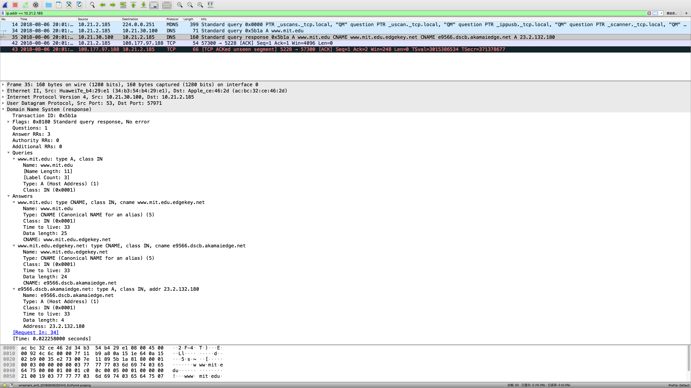
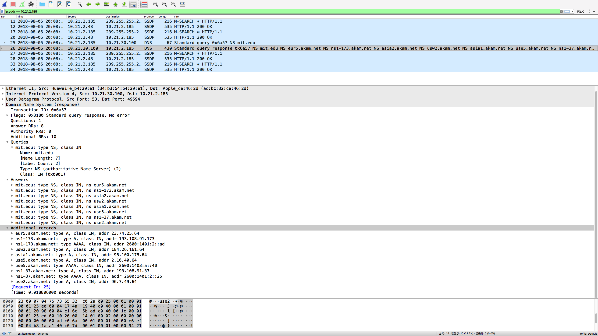
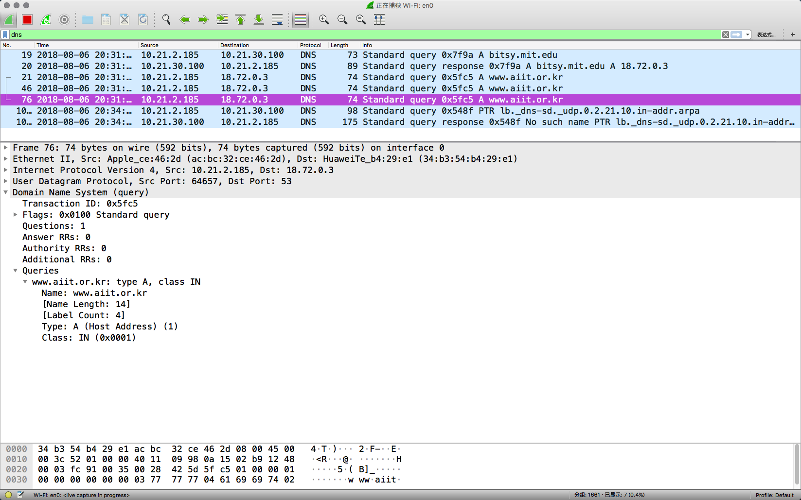

**Macbook 清除DNS缓存的方法：**

1. 打开Terminal

2.  根据不同版本输入不同的命令，然后Enter ，输入密码，清除成功会有语音提示

   *macOS Sierra :*

   ```sudo killall -HUP mDNSResponder;say DNS cache has been flushed```

   或者

   ```sudo killall -HUP mDNSResponder;sudo killall mDNSResponderHelper;sudo dscacheutil -flushcache;say MacOS DNS cache has been cleared```

   *macOS High Sierra :*

    ```sudo killall -HUP mDNSResponder; sleep 2; echo macOS DNS Cache Reset | say```

   *Mac OS X El Capitan and Yosemite :*

   ```sudo dscacheutil -flushcache;sudo killall -HUP mDNSResponder;say cache flushed```

   [查看其他版本>>](https://macpaw.com/how-to/clear-dns-cache-on-mac)

### 参考答案

------

1. ``nslookup www.douban.com``

   结果：

   ```
   Non-authoritative answer:
   Name:	www.douban.com
   Address: 154.8.131.171
   Name:	www.douban.com
   Address: 154.8.131.172
   Name:	www.douban.com
   Address: 154.8.131.165
   ```

2. ```nslookup -type=NS berklee.edu```

   ```
   Server:		***** # 本地DNS服务器
   Address:	*****

   Non-authoritative answer:
   berklee.edu	nameserver = ns2.p21.dynect.net.
   berklee.edu	nameserver = ns1.p21.dynect.net.
   berklee.edu	nameserver = ns2.berklee.edu.
   berklee.edu	nameserver = ns4.p21.dynect.net.
   berklee.edu	nameserver = ns3.p21.dynect.net.

   Authoritative answers can be found from:
   ns2.p21.dynect.net	internet address = 204.13.250.21
   ns1.p21.dynect.net	internet address = 208.78.70.21
   ns1.p21.dynect.net	has AAAA address 2001:500:90:1::21
   ns2.berklee.edu	internet address = 192.136.22.11
   ns4.p21.dynect.net	internet address = 204.13.251.21
   ns3.p21.dynect.net	internet address = 208.78.71.21
   ns3.p21.dynect.net	has AAAA address 2001:500:94:1::21
   ```

3. 貌似不支持指定DNS服务器的这种查询，一直失败， 直接查询是可以的，雅虎邮件服务器是87.248.100.137

4. 通过UDP发送

5. DNS查询消息的目标端口和响应消息的源端口都是 53

6. DNS查询消息的目标IP地址是114.114.114.114，并不本地默认的DNS服务器的IP地址， 本地的DNS服务器IP地址是10.21.30.100#53

7. Type 是 A  (Host Address)， 查询消息不包含任何answer

8. “answer”的个数不是固定的，1个以上，主要包括查询的主机别名消息，主机地址消息等。

9. 是相对应的

10. 并不是，只是部分重新发出了新的DNS查询

11. 都是 53

12. 是本地DNS服务器的IP地址

13. Type A， 不包含任何“answer”

14. 提供了3个“answer”，包含了两个主机别名和主机IP地址

15. 
16. 是

17. type NS, 不包含任何“answer”

18. 很多个，详见下图

19. 

20. DNS第一次查询消息发送的IP地址是默认的本地域名服务器，查询到bitsy.mit.edu的IP地址：18.72.0.3，之后向这个IP地址发送查询消息，但失败了，因为MIT的这个DNS服务器已[停用](https://stuff.mit.edu/afs/sipb/user/tlyu/lothlorien/ntp.conf)

21. Type A， 不包含任何"answer"

22. 因为查询失败，提供了0个“answer”

23. 
