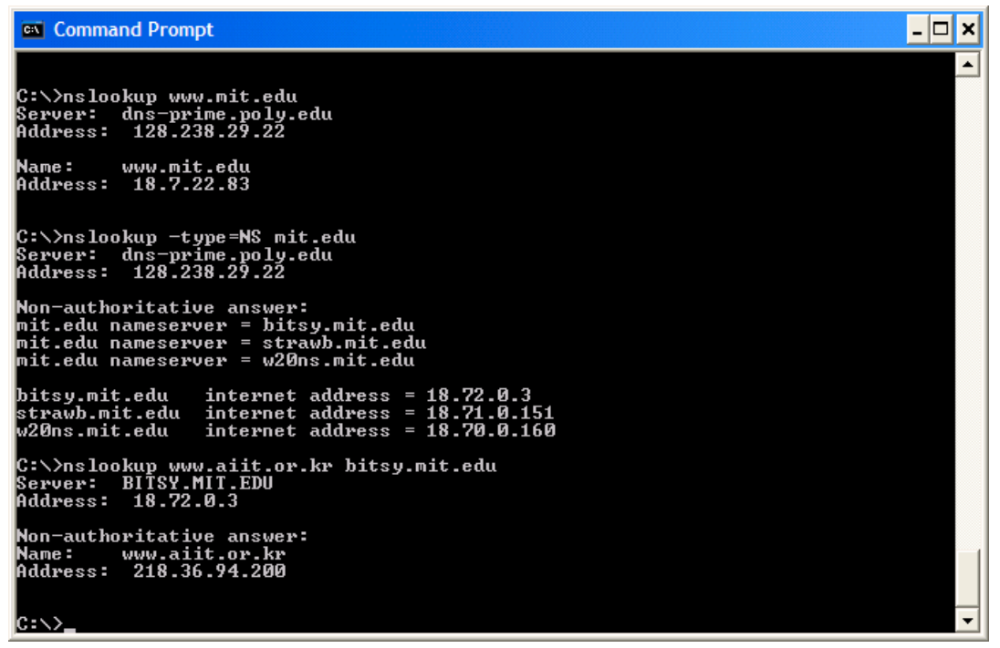
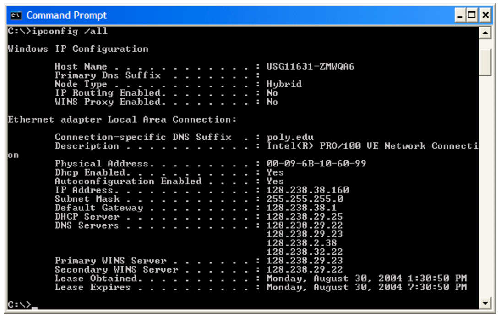

# Wireshark实验 - DNS

**官方英文文档：[Wireshark_Intro_v6.01.pdf](Wireshark_Intro_v6.01.pdf)**  

**以下内容为笔者翻译：**

------

## Wireshark 实验:  DNS v6.01

***《计算机网络：自顶向下方法（第6版）》*补充材料，J.F. Kurose and K.W. Ross**

“不闻不若闻之，闻之不若见之，见之不若知之，知之不若行之。” ——中国谚语 

© 2005-2012, J.F Kurose and K.W. Ross, All Rights Reserved

------

如书中第2.5节所述，域名系统(DNS)将主机名转换为IP地址，在互联网基础架构中发挥关键作用。在本实验中，我们将仔细查看DNS在客户端的细节。回想一下，客户端在DNS中的角色相对简单——客户端向其本地DNS服务器发送*请求*，并接收一个*响应*。如书中的图2.21和2.22所示，由于DNS分层服务器之间相互通信，可以递归地或迭代地解析客户端的DNS查询请求，而大多数操作是不可见的。然而，从DNS客户端的角度来看，协议非常简 ——将查询指向为本地DNS服务器，并从该服务器接收到响应。

在开始本实验之前，您可能需要阅读书中的第2.5节来了解DNS。另外，您可能需要查看关于**本地DNS服务器，DNS缓存，DNS记录和消息，以及DNS记录中的TYPE字段**的资料。

### 1. nslookup

在本实验中，我们将大量使用*nslookup*工具，这个工具在现在的大多数Linux/Unix和Microsoft平台中都有。要在Linux/Unix中运行*nslookup*，您只需在命令行中键入*nslookup*命令即可。要在Windows中运行，请打开命令提示符并在命令行上运行*nslookup*。

在这是最基本的操作，*nslookup*工具允许主机查询任何指定的DNS服务器的DNS记录。DNS服务器可以是根DNS服务器，顶级域DNS服务器，权威DNS服务器或中间DNS服务器（有关这些术语的定义，请参阅书本）。要完成此任务，*nslookup*将DNS查询发送到指定的DNS服务器，然后接收DNS回复，并显示结果。

上面的屏幕截图显示了三个不同*nslookup*命令的结果（显示在Windows命令提示符中）。在此示例中，客户端主机位于布鲁克林理工大学校园，默认本地DNS服务器为dns-prime.poly.edu。运行nslookup时，如果没有指定DNS服务器，则*nslookup*会将查询发送到默认的DNS服务器（在这种情况下为dnsprime.poly.edu）。来看第一个命令：

`nslookup www.mit.edu`

说这个命令是说，请告诉我主机 www.mit.edu 的IP地址。如屏幕截图所示，此命令的响应提供两条信息：（1）提供响应的DNS服务器的名称和IP地址；（2）响应本身，即 www.mit.edu 的主机名和IP地址。虽然响应来自理工大学的本地DNS服务器，但本地DNS服务器很可能会迭代地联系其他几个DNS服务器来获得结果，如书中第2.4节所述。

现在来看第二个命令：

`nslookup -type=NS mit.edu`

在这个例子中，我们添加了选项"-type=NS"和域名"mit.edu"。这将使得*nslookup*将NS记录发送到默认的本地DNS服务器。换句话说，“请给我发送mit.edu的权威DNS的主机名” （当不使用-type选项时，*nslookup*使用默认值，即查询A类记录。）上述屏幕截图中，首先显示了提供响应的DNS服务器（这是默认本地DNS服务器）以及三个MIT域名服务器。这些服务器中的每一个确实都是麻省理工学院校园主机的权威DNS服务器。然而，*nslookup*也表明该响应是非权威的，这意味着这个响应来自某个服务器的缓存，而不是来自权威MIT DNS服务器。最后，响应结果还显示了麻省理工学院权威DNS服务器的IP地址。 （即使*nslookup*生成的NS类型查询没有明确要求IP地址，本地DNS服务器依然”免费“返回了这些信息，然后被*nslookup*显示出来。）

最后来看第三个命令：

`nslookup www.aiit.or.kr bitsy.mit.edu`

在这个例子中，我们希望将查询请求发送到DNS服务器 bitsy.mit.edu ，而不是默认的DNS服务器（dns-prime.poly.edu）。因此，查询和响应事务直接发生在我们的主机和 bitsy.mit.edu 之间。在这个例子中，DNS服务器 bitsy.mit.edu 提供主机 www.aiit.or.kr 的IP地址，它是高级信息技术研究所（韩国）的Web服务器。

现在我们了解了一些示例，您仙子啊可能想知道*nslookup*命令的一般语法。语法是：

`nslookup -option1 -option2 host-to-find dns-server`

一般来说，*nslookup*可以不添加选项，或者添加一两个甚至更多选项。正如我们在上面的示例中看到的，dns-server也是可选的；如果这项没有提供，查询将发送到默认的本地DNS服务器。

现在我们提供了总览了*nslookup*，现在是你自己驾驭它的时候了。执行以下操作（并记下结果）：

1.运行*nslookup*以获取一个亚洲的Web服务器的IP地址。该服务器的IP地址是什么？
2.运行*nslookup*来确定一个欧洲的大学的权威DNS服务器。
3.运行*nslookup*，使用问题2中一个已获得的DNS服务器，来查询Yahoo!邮箱的邮件服务器。它的IP地址是什么？

### 2. ipconfig

*ipconfig*（对于Windows）和*ifconfig*（对于Linux / Unix）是主机中最实用的程序，尤其是用于调试网络问题时。这里我们只讨论*ipconfig*，尽管Linux / Unix的*ifconfig*与其非常相似。 *ipconfig*可用于显示您当前的TCP/IP信息，包括您的地址，DNS服务器地址，适配器类型等。例如，您只需进入命令提示符，输入

`ipconfig /all`

所有关于您的主机信息都类似如下面的屏幕截图所显示。

*ipconfig*对于管理主机中存储的DNS信息也非常有用。在第2.5节中，我们了解到主机可以缓存最近获得的DNS记录。要查看这些缓存记录，在 C:\\> 提示符后输入以下命令：

`ipconfig /displaydns`

每个条目显示剩余的生存时间（TTL）（秒）。要清除缓存，请输入

`ipconfig /flushdns`

清除了所有条目并从hosts文件重新加载条目。

### 3. 使用Wireshark追踪DNS

现在，我们熟悉nslookup和ipconfig，我们准备好了一些严肃的事情。让*首先捕获由普通Websurfing活动生成的DNS数据包。

？使用ipconfig清空主机中的DNS缓存。
？打开浏览器并清空浏览器缓存。 （使用Internet Explorer，转到工具菜单并选择Internet选项;然后在常规选项卡中选择删除文件。）
？打开Wireshark，然后在过滤器中输入※ip.addr ==your_IP_address§，在那里您可以使用ipconfig获取your_IP_address。此过滤器将删除既不发起也不发往主机的所有数据包。
？在Wireshark中启动数据包捕获。
？使用浏览器，请访问网页：http：//www.ietf.org
？停止数据包捕获。

如果您无法在实时网络连接上运行Wireshark，则可以在其中一个作者的计算机2上按照上述步骤下载捕获的数据包跟踪文件。回答下列问题。只要有可能，在回答下面的问题时，您应该在用于回答所问问题的踪迹中输入打包的数据包。注释打印输出3来解释你的答案。要打印数据包，请使用文件 - >打印，仅选择所选数据包，选择数据包摘要行，并选择需要回答问题的最小数据包详细信息。

4.找到DNS查询和响应消息。然后通过UDP或TCP发送？
5. DNS查询消息的目标端口是什么？ DNS响应消息的源端口是什么？
  6.发送DNS查询消息的IP地址？使用ipconfig来确定本地DNS服务器的IP地址。这两个IP地址是否相同？
  7.检查DNS查询消息。什么※类型的DNS查询是吗？查询消息是否包含任何※答案？
  8.检查DNS响应消息。提供了多少个答案？这些答案包含什么？

2下载zip文件http://gaia.cs.umass.edu/wireshark-labs/wireshark-traces.zip并提取文件dnsethereal-trace-1。在执行Wireshark实验室中指出的步骤的同时，这个zip文件中的痕迹由Wireshark收集，在其中一个作者的计算机上运行。一旦下载了跟踪，您可以将其加载到Wireshark中，并使用文件下拉菜单，选择打开，然后选择dns-ethereal-trace-1跟踪文件来查看跟踪。

3※注释是什么意思？如果您提交了纸质文本，请突出显示您在哪里找到答案，并添加一些文字（最好用彩色笔），注意您在什么中突出显示的内容。如果您提交电子版本，如果您也可以突出显示和注释，那将是非常好的。

9.考虑您的主机发送的后续TCP SYN数据包。 SYN数据包的目的IP地址是否与DNS响应消息中提供的任何IP地址相对应？
10.这个网页包含图像。在检索每个图像之前，您的主机是否发出新的DNS查询？

现在让*玩nslookup。

？启动数据包捕获。
？在www.mit.edu做一个nslookup
？停止数据包捕获。

你应该得到一个如下所示的痕迹：

我们从上面的屏幕截图看到，nslookup实际上发送了三个DNS查询，并收到了三个DNS响应。为了进行此任务，在回答以下问题时，请忽略前两组查询/响应，因为它们特定于nslookup，通常不会由标准Internet应用程序生成。您应该专注于最后一个查询和响应消息。

4如果无法运行Wireshark并捕获跟踪文件，请使用zip文件中的跟踪文件dns-ethereal-trace-2 http://gaia.cs.umass.edu/wireshark-labs/wireshark-traces.zip

11. DNS查询消息的目标端口是什么？ DNS响应消息的源端口是什么？
   12.发送DNS查询消息的IP地址？这是您的默认本地DNS服务器的IP地址吗？
   13.检查DNS查询消息。什么※类型的DNS查询是？查询消息是否包含任何※答案？
   14.检查DNS响应消息。提供了多少个答案？这些答案包含什么？
   提供屏幕截图。

现在重复上一个实验，而是发出命令：

nslookup -type = NS mit.edu

回答下列问题：

16.发送DNS查询消息的IP地址是什么？这是您的默认本地DNS服务器的IP地址吗？
17.检查DNS查询消息。什么※类型的DNS查询是吗？查询消息是否包含任何※答案？
18.检查DNS响应消息。响应消息提供的MIT名称服务器是什么？此响应消息还提供了MIT名称器的IP地址吗？
提供屏幕截图。

现在重复上一个实验，而是发出命令：

nslookup www.aiit.or.kr bitsy.mit.edu

回答下列问题：

20.发送DNS查询消息的IP地址是什么？这是您的默认本地DNS服务器的IP地址吗？如果不是，IP地址是对应的？
21.检查DNS查询消息。什么※类型的DNS查询是吗？查询消息是否包含任何※答案？
22.检查DNS响应消息。提供了多少个答案？这些答案包含什么？
提供截图。

5如果无法运行Wireshark并捕获跟踪文件，请使用zip文件中的跟踪文件dns-ethereal-trace-3 http://gaia.cs.umass.edu/wireshark-labs/wireshark-traces.zip
6如果无法运行Wireshark并捕获跟踪文件，请使用zip文件中的跟踪文件dns-ethereal-trace-4 http://gaia.cs.umass.edu/wireshark-labs/wireshark-traces.zip

