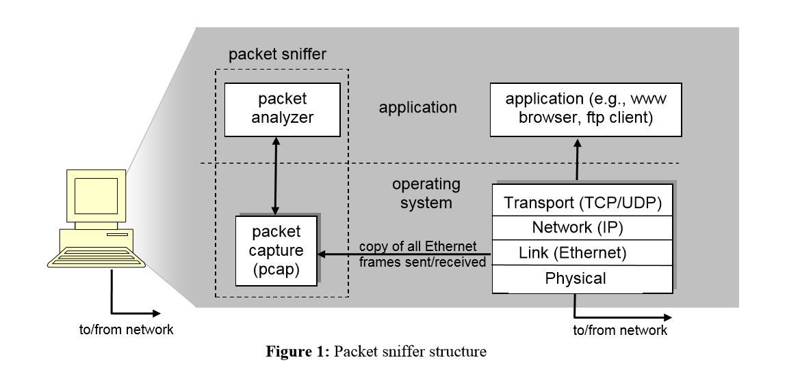
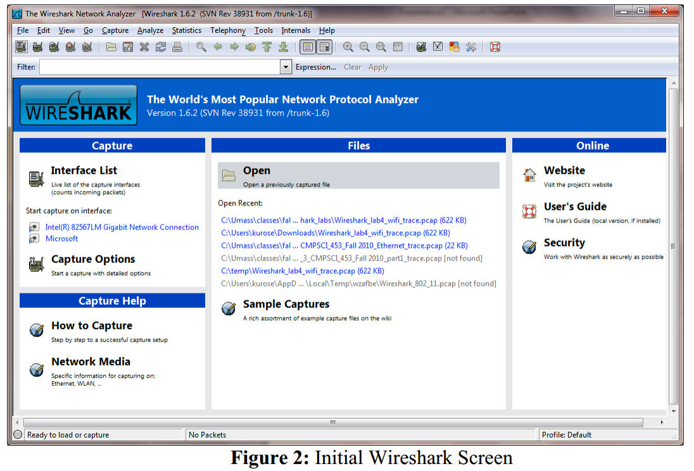

# Wireshark实验 - 入门

**官方英文文档：[Wireshark_Intro_v6.0.pdf](Wireshark_Intro_v6.0.pdf)**  

**以下内容为笔者翻译：**

***

## Wireshark 实验:  入门 v6.0 

**《计算机网络：自顶向下方法（第6版）》补充材料，J.F. Kurose and K.W. Ross**

“不闻不若闻之，闻之不若见之，见之不若知之，知之不若行之。” ——中国谚语 

© 2005-2012, J.F Kurose and K.W. Ross, All Rights Reserved

***

加深对网络协议的理解通常可以通过观察协议的运行和不断调试协议来大大加深，具体而言，就是观察两个协议实体之间交换的报文序列，深入了解协议操作的细节，执行某些动作，然后观察这些动作产生的结果。这可以在仿真环境中或在诸如因特网的真实网络环境中完成。您将在本课程中进行这些Wireshark实验，您将使用自己的电脑在不同的场景下运行各种网络应用程序（如果您无法h获得计算机，或无法安装/运行Wireshark，您可以借用朋友的电脑）。您将观察您的计算机中网络协议与Internet其他主机的协议实体进行交换消息的动作。因此，您和您的计算机将是这些“实时”实验室的一部分。你会通过动手实践观察到并学习到许多。

在第一个Wireshark实验中，你会熟悉Wireshark，并做一些简单的抓包和观察。

用于观察执行协议实体之间交换的消息的基本工具称为**分组嗅探器(packet sniffer)**。顾名思义，分组嗅探器捕获（“嗅探”）从计算机发送/接收的消息; 它还将存储并显示这些捕获的消息中各种协议字段的内容。分组嗅探器本身是被动的。它只是观察有计算机上运行的应用程序和协议发送和接收的消息，但本身不会发送分组。类似地，接收的分组也不会直接到达分组嗅探器。相反，分组嗅探器接收一份从您的机器中的应用程序和协议发送/接收的分组的*副本*。

图1显示了分组嗅探器的结构。在图1的右侧通常是在您计算机上运行的协议（在这种情况下为Internet协议）和应用程序（如Web浏览器或ftp客户端）。图1中虚线框中显示的分组嗅探器是计算机中一种进阶的常规软件，并且包含两部分。**分组捕获库**接收从计算机发送或接收的每个链路层帧的副本。回顾书中第1.5节的讨论（图1-24），较高层协议（如HTTP，FTP，TCP，UDP，DNS或IP）交换的消息最终将被封装在通过物理介质传输的链路层帧中，例如以太网电缆。在图1中，假设的物理介质是以太网，因此所有上层协议最终被封装在以太网帧中。捕获所有链路层帧可以让您从计算机中获得所有协议和应用程序发送/接收的消息。

**图1 - 分组嗅探器结构**

分组嗅探器的第二个组件是**分组分析器(packet analyzer)**，显示协议消息中所有字段的内容。为了做到这一点，分组分析器必须“理解”协议交换的所有消息的结构。 例如，假设我们有兴趣在图1中的HTTP协议交换的消息中显示各种字段。分组分析器了解以太网帧的格式，因此可以识别以太网帧中的IP数据报。它还可以理解IP数据报格式，从而可以提取IP数据报中的TCP段。 最后，它理解TCP段结构，因此可以提取TCP段中包含的HTTP消息。 最终，它还理解HTTP协议，因此，就可以知道HTTP消息的第一部分将包含字符串“GET”，“POST”或“HEAD”，如书中的图2-8所示。

我们将使用Wireshark分组嗅探器( http://www.wireshark.org/ )进行这些实验，从而显示在协议栈不同级别的协议发送/接收的消息的内容。(从技术上讲，Wireshark是一个使用计算机中的分组捕获库的分组分析器)。 Wireshark是一种免费的网络协议分析器，可在Windows，Mac和Linux / Unix计算机上运行。 它是我们实验室的理想分组分析器 - 因为它稳定，具有庞大的用户基础和文档支持，包括用户指南( http://www.wireshark.org/docs/wsug_html_chunked/ )，手册( http://www.wireshark.org/docs/man-pages/ )和常见问题细节( http://www.wireshark.org/faq.html )，丰富的功能，包括分析数百种协议，以及精心设计的用户界面。 它可以运行在使用以太网，串行(PPP和SLIP)，802.11无线局域网和许多其他链路层技术的计算机上(如果操作系统支持Wireshark这样做)。

### 获取Wireshark

为了运行Wireshark，您需要一台支持Wireshark和libpcap或WinPCap分组捕获库的计算机。当您安装Wireshark时，如果您的操作系统中未安装libpcap软件，它将会自动安装。有关支持的操作系统和下载站点的列表，请访问http://www.wireshark.org/download.html

下载并安装Wireshark软件：

* 转到http://www.wireshark.org/download.html 下载并安装计算机的Wireshark安装包。 

Wireshark FAQ有一些有用的提示和有趣的信息，尤其是您在安装或运行Wireshark时遇到问题的时候。

### 运行Wireshark

当您运行Wireshark程序时，您将看到一个类似下面的启动界面：

**图2 - Wireshark初始界面**

注意界面的左上角，你会看到一个“接口列表”。这是您的计算机上的网络接口列表。一旦你选择了一个接口，并将捕获这个接口上的所有数据包。在上面的例子中，有一个以太网接口（Gigabit network Connection ）和一个无线网络接口（“Microsoft” ）。

如果您点击其中一个接口启动分组捕获（即，Wireshark开始捕获从该接口发送的所有分组），将显示如下所示的界面，包含有关正在捕获的分组的信息。启动分组捕获后，可以使用“捕获”下拉菜单并选择“停止”来停止分组捕获。

**图3-Wireshark抓包和分析时的用户界面**

Wireshark界面有五个主要组件：

**命令菜单(command menus)**是位于窗口顶部的标准下拉菜单。我们现在感兴趣的是文件和捕获菜单。文件菜单允许您保存捕获的分组数据或打开先前捕获的分组数据的文件，并退出Wireshark应用程序。捕获菜单允许您开始分组捕获。

**分组列表窗口(packet-listing window)**为每个捕获的分组显示一行摘要，包括分组编号（由Wireshark分配；任何协议首部并不包含该编号），分组的时间，源地址和目的地址，协议类型以及分组中包含的协议特定信息。可以通过单击列名称或者其他类似栏目对分组列表进行排序。协议类型字段列出了发送或接收该分组的最高级协议，即作为该分组的源或最终接收的协议。

**分组首部详细信息窗口(packet-header details window)**提供分组列表窗口中被选中（高亮显示）分组的详细信息。 （要在分组列表窗口中选择分组，请将光标放在分组列表窗口中的单行摘要中，然后单击鼠标左键。）这些细节包括有关以太网帧的信息（假定分组通过以太网接口发送/接收）和包含该分组的IP数据报。通过在分组详细信息窗口中单击以太网帧左侧的加减号框或IP数据报行，可以扩展或最小化显示的以太网和IP层详细信息。如果分组通过TCP或UDP传输，TCP或UDP的详细信息也将被显示，同样可以扩展或最小化。最后还提供了有关发送或接收此分组的最高级别协议的详细信息。

**分组正文窗口(packet-contents window)**以ASCII和十六进制格式显示捕获帧的全部内容。
Wireshark界面的顶部是**分组显示过滤器(packet display filter field)**，可以向其中输入协议名称或其他信息，以过滤分组列表窗口中显示的信息（分组首部窗口和分组内容窗口同理）。在下面的示例中，我们将使用分组显示过滤器字段来使Wireshark隐藏（不显示）除了与HTTP消息相关的分组。

### 用Wireshark做一次运行测试

了解任何新软件的最好方法是尝试一下！ 我们假设您的计算机通过有线以太网接口连接到Internet。 事实上，我建议您在具有有线以太网连接的计算机上执行此第一个实验室，而不仅仅是无线连接。 请执行以下操作

1. 启动您喜欢的网页浏览器，显示您选择的主页。
2. 启动Wireshark软件。 您最初将看到类似于图2所示的窗口.Wireshark尚未开始捕获分组。
3. 要开始分组捕获，请选择“捕获”下拉菜单，然后选择“选项”。 这将显示“Wireshark：Capture Interfaces”窗口，如图4所示。

**图4-Wireshark抓包接口窗口**

4. 您将看到计算机上的接口列表以及到目前为止在该接口上观察到的分组的计数。单击“开始”以开始分组捕获的接口（这个例子下，就是"Gigabit network Connection"）。分组捕获现在将开始 - Wireshark正在捕获从您的计算机发送/接收的所有分组！
5. 一旦开始分组捕获，将出现类似于图3所示的窗口。此窗口显示正在捕获的分组。通过选择捕获下拉菜单并选择停止，您可以停止分组捕获。但是现在不要停止分组捕获。我们首先捕获一些有趣的分组。为此，我们需要产生一些网络流量。让我们使用Web浏览器，这将使用我们将在课堂上详细研究过的HTTP协议来从网站下载内容。
6. 当Wireshark正在运行时，输入URL：http://gaia.cs.umass.edu/wireshark-labs/INTRO-wireshark-file1.html ，并在浏览器中显示该页面。为了显示此页面，您的浏览器将通过gaia.cs.umass.edu与HTTP服务器链接，并与服务器交换HTTP消息，以便下载此页面，如书中第2.2节所述。包含这些HTTP消息（以及通过以太网的所有其他帧）的以太网帧将被Wireshark捕获。
7. 在浏览器显示INTRO-wireshark-file1.html页面后（这是一行简单的祝贺消息），在Wireshark捕获窗口中点击停止按钮来停止Wireshark分组捕获。现在Wireshark主窗口看起来与图3相似。您现在有了计算机和其他网络实体之间交换的所有协议的实时分组数据！与gaia.cs.umass.edu 的Web服务器交换的HTTP消息应该出现在捕获分组的列表中。但是，这里还会显示许多其他类型的分组（例如，图3中的协议列中显示了许多不同的协议类型）。即使你唯一的动作仅仅是下载了一个网页，但显然还有许多其他协议在您的计算机上运行，这些是用户所看不见的。通过书中内容，我们将更多地了解这些协议！现在，你会亲眼看到许多事情即将发生！
8. 在主Wireshark窗口顶部的分组显示过滤器窗口中，键入“http”（不含引号，且小写 - Wireshark中的所有协议名称均为小写）。然后选择应用（在您输入“http”位置的右侧）。这样就可以只让HTTP消息显示在分组列表窗口中。
9. 找到从您的计算机发送到gaia.cs.umass.edu HTTP服务器的HTTP GET消息。 （在Wireshark分组列表窗口中查找HTTP GET消息（见图3），其后的gaia.cs.umass.edu URL中显示“GET”）当您选择该HTTP GET消息，那么它的以太网帧，IP数据报，TCP段和HTTP消息首部将显示在分组首部窗口中，通过点击左侧的“+”和“ - ”或向右和向下箭头的分组详细信息窗口，将帧，以太网，IP协议和TCP协议的信息最小化，同时将HTTP协议的信息最大化，您的Wireshark显示屏现在应该如图5所示。（注意，特别是除了HTTP之外的所有协议的协议信息的最小量以及在分组报头窗口中用于HTTP的协议信息的最大量）。

**图5-执行第9步之后的Wireshark窗口**

10. 退出Wireshark

恭喜！你现在已经完成了第一个实验。

### 需要提交的内容

第一个实验的目的主要是向你介绍Wireshark。以下问题将证明您已经能够使Wireshark启动并运行，并且已经探索了其中一些功能。根据您的Wireshark实验回答以下问题：

1. 列出上述步骤7中出现在未过滤的分组列表窗口的协议列中的3种不同的协议。
2. 从HTTP GET消息发送到HTTP OK回复需要多长时间？ (默认情况下，分组列表窗口中的时间列的值是自Wireshark开始捕获以来的时间(以秒为单位)。要想以日期格式显示时间，请选择Wireshark的“视图”下拉菜单，然后选择“时间显示格式”，然后选择“日期和时间”。)
3. gaia.cs.umass.edu(也称为wwwnet.cs.umass.edu)的Internet地址是什么？您的计算机的Internet地址是什么？
4. 打印问题2提到的两个HTTP消息(GET和OK)。要这样做，从Wireshark的“文件”菜单中选择“打印”，然后选择“仅选中分组”和“按当前显示”按钮，然后单击确定。

